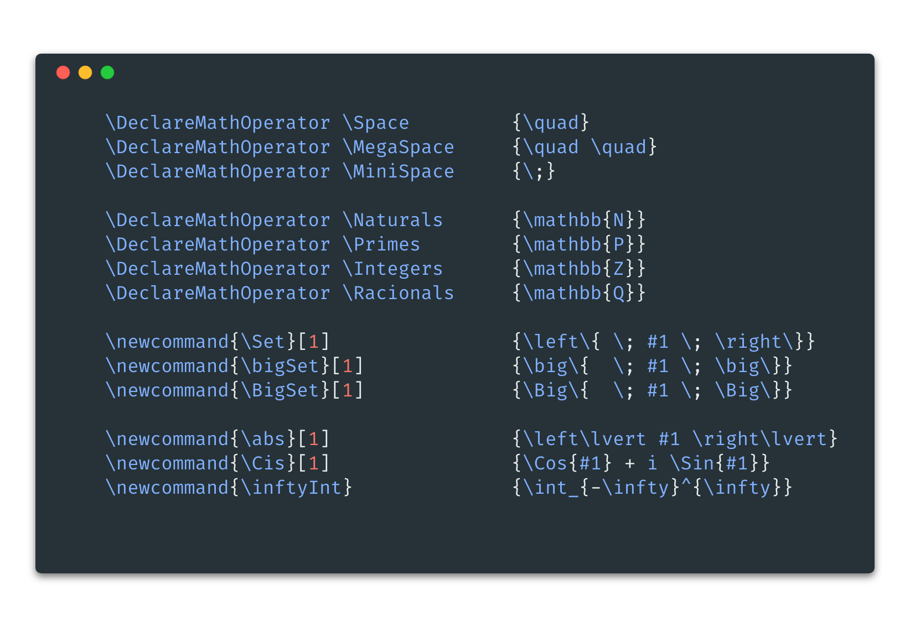
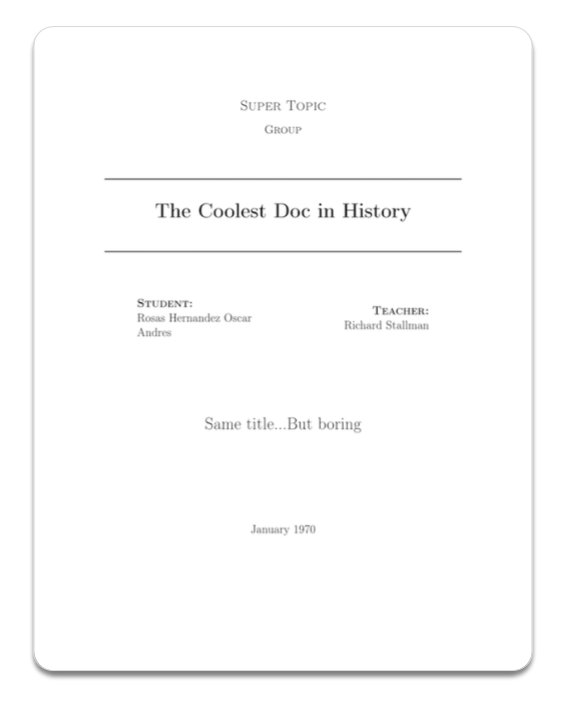
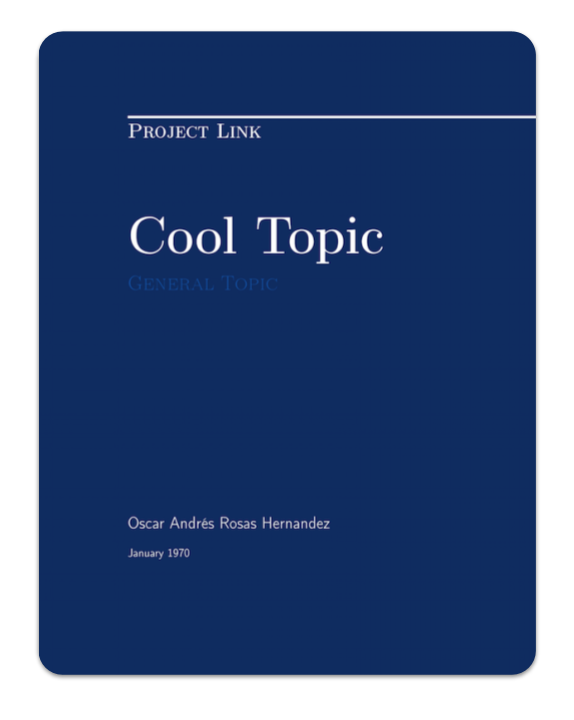

## What is this?
This repo is a collection of many utilities that we use as a
team to create our LaTeX books and reports.

You can copy and use all of this code, use it to create awesome things, we believe in you.

## Templates: 
- **Header for OUR Books**: [Header.tex](MyHeaderForHugeFiles.tex)
- **Codes for math and tables**: [Math.tex](Math.tex)
- **Codes for code input**: [Code.tex](Code.tex)
- **Insert image or wrap it around text**: [Images.tex](Images.tex)

## Compilando Commands
To create this books we create many new commands  (specially about math) we will love if you
use them. You can find them here 
[Commands.tex](Commands.tex) 

Here are some that we think you find useful:

## Cover:

#### Original Cover
[See Result](CoverBlackAndWhite.pdf) -
[See Code](CoverBlackAndWhite.tex)

#### Color Cover
[See Result](CoverColor.pdf) - 
[See Code](CoverColor.tex)

